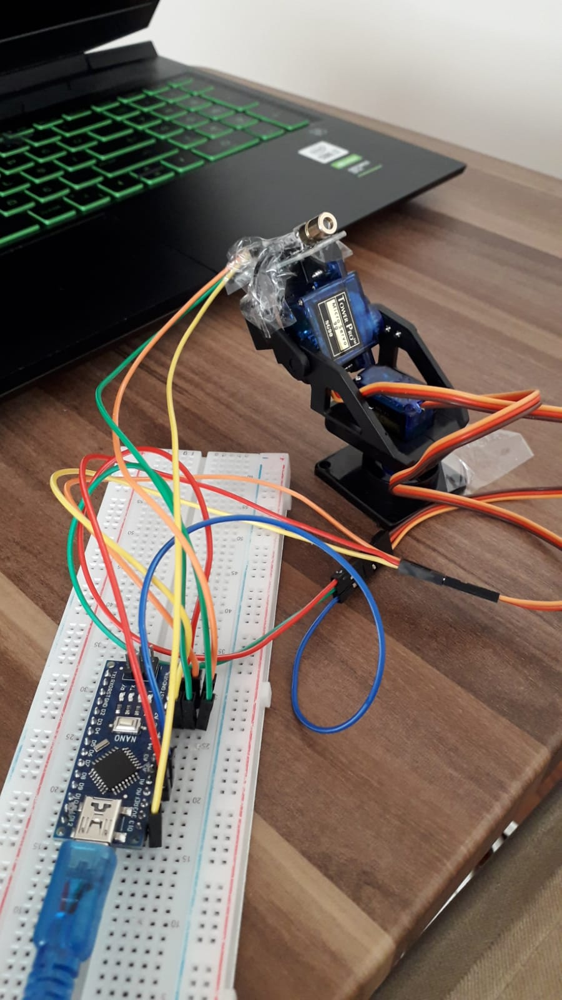
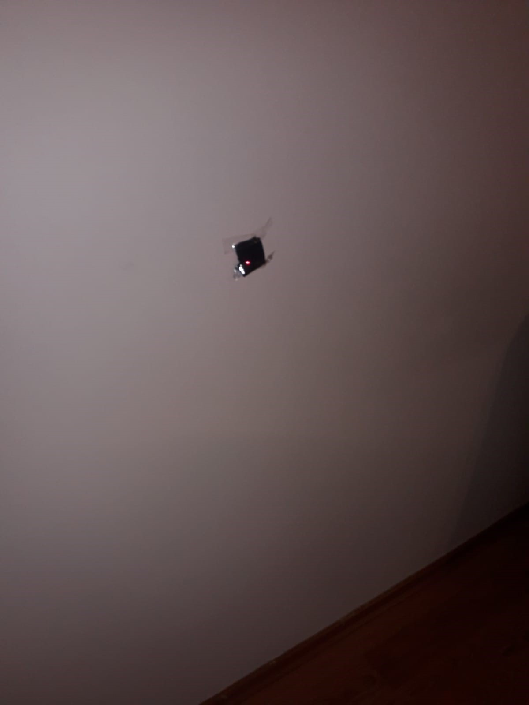

# RoboticArm
## Aim
This project; By rotating its robotic arm, it calculates the center of the specified image and sends its laser to that center.
The aim of this project is to enable the robot to detect the black dot in the area shown by the camera, take the position of the robot's arm according to that point, and shoot at the center of that point with the laser.
## Steps
The first step of the project is to assemble the robot arm and connect it to the Arduino. The steps I followed while applying them are as follows: In the project, I first connected the Arduino to the breadboard. Then I mounted the mini pen/camera platforms with screws. I placed the servo motors inside and adjusted the dimensions of the propellers of the servo motors according to the mini pen/camera platform. I cut the propellers of the servo motors that did not fit properly and placed them inside the camera platforms. After I mounted the servo motors, I connected their cables to the Arduino (I connected the lowest servo motor to A1, 5V and Gnd. I connected the top servo motor to A2,5V and Gnd). Finally, I placed the laser pin on the top of my camera platform at a 90-degree angle, siliconized and taped. I connected the cables of the lazar pin to the corresponding Arduino parts (5V, Gnd, and D13). Thus, I completed the first step of my project, assembling the robot arm and connecting it to the Arduino. And so I have completed the physical part of my project.
## Robotic Arm Image

## Second Step
The second step is the code part. The code part consists of two parts: Arduino and C#. When I plug in the cable for the Arduino part, it allows the robot to work according to the code I wrote, according to the selected port in Arduino. In the Arduino code, I provided the movement of the robot for defined the servo motors and the pin. In Ardunio code it provides communication between Ardunio and C# with serial ports. 
The second part of the code is to write code in C# and connect it to the Arduino. The reason why I write code in C#; is to connect the camera to the Arduino convert the image on the camera to black and white and make the robot shoot the black dot in that image with a laser. For this, I need to connect to my robotic arm and camera so I defined the camera in the code and I take three different color images to camera. My purpose of C# code is: find the middle point in the image, calculate the distance of that point to the black point, and aim the robot to go in that direction, For these purpose; I defined xpx, ypx points. I wrote a formula that will divide these points into pixel numbers and subtract/add from the width or height of the black and white image, thus calculating the midpoints relative to the x and y points. I calculated the Th1 (servo motor 1) and Th2 (servo motor 2) values by calculating the Inverse Kinematic formula. So I made the robot's arm go to the black dot with this code. 

